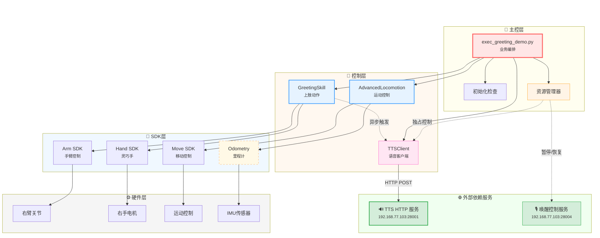
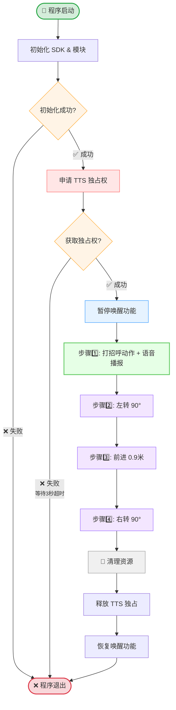
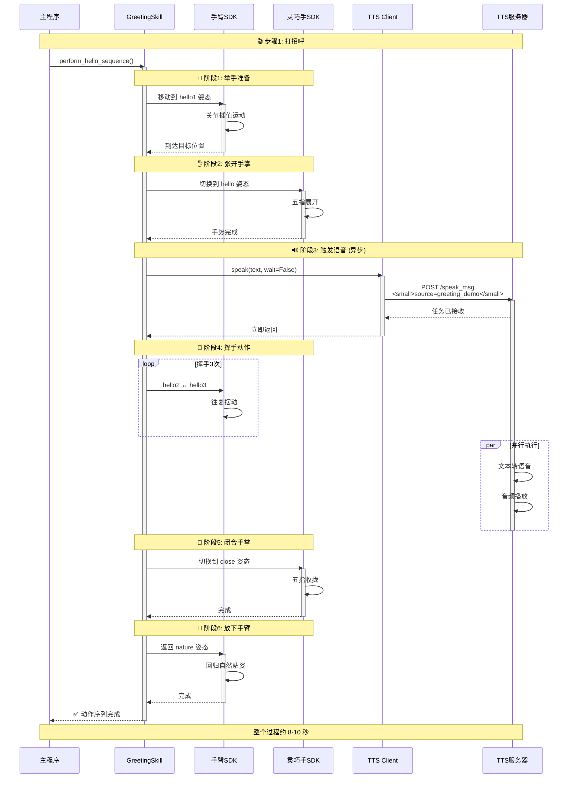
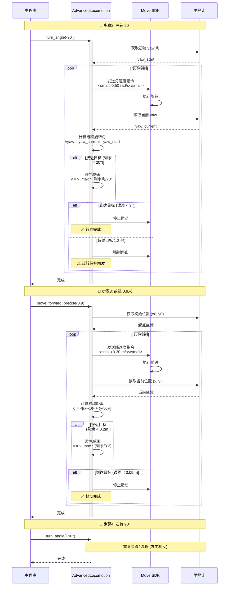

# G1 迎宾演示 V3 (重构版) 文档

本文档详细说明了 `exec_greeting_demo.py` 及其相关组件的实现细节、使用方法和架构设计。

## 1. 简介

`exec_greeting_demo.py` 是 G1 机器人的迎宾演示程序。该程序协调了上肢动作（打招呼）、语音播报（TTS）以及底盘运动（精确移动与转向），展示了机器人接待访客的标准流程。

### 主要功能
1. **语音与动作协同**：在执行打招呼动作的同时进行语音播报。
2. **精确运动控制**：利用里程计反馈实现精确的直行和原地转向。
3. **资源管理**：
   - **TTS 独占模式**：防止演示过程中被其他语音指令打断。
   - **唤醒抑制**：演示过程中暂时屏蔽语音唤醒功能。

---

## 2. 系统架构

### 2.1 架构概览

### 2.2 核心模块依赖

演示程序依赖以下核心模块：

| 模块 | 文件路径 | 功能描述 |
| :--- | :--- | :--- |
| **主程序** | `exec_greeting_demo.py` | 业务逻辑编排，负责初始化和按步骤执行演示流程。 |
| **迎宾技能** | `.../skills/greeting_skill.py` | 封装了手臂和灵巧手的控制逻辑，加载预设姿态文件，执行"挥手"动作序列。 |
| **高级运动** | `.../common/advanced_locomotion.py` | 基于里程计（Odometry）闭环控制底盘，提供 `move_forward_precise` 和 `turn_angle` 方法。 |
| **TTS 客户端** | `.../common/tts_client.py` | 处理 HTTP TTS 请求，管理独占模式（Exclusive Mode）。 |

---

## 3. 完整业务流程

### 3.1 步骤1详解：迎宾动作序列

### 3.2 步骤2-4详解：底盘精确运动

---