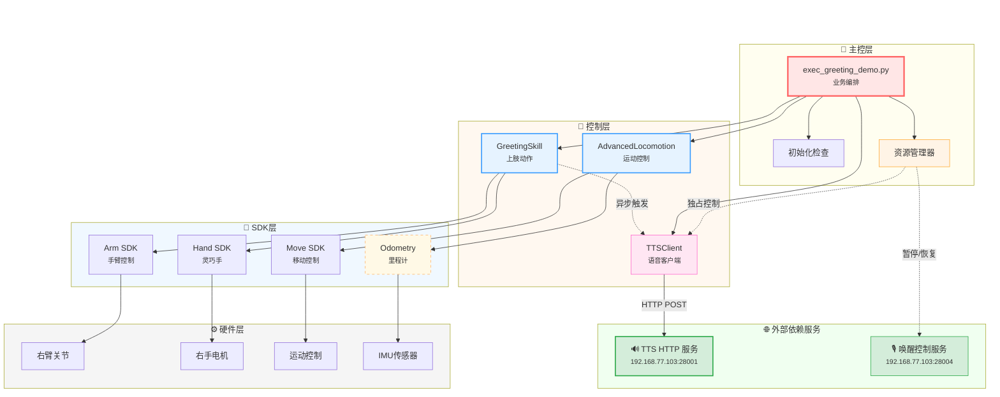

```mermaid
graph TB
    subgraph external ["🌐 外部依赖服务"]
        direction LR
        TTS_Server["🔊 TTS HTTP 服务<br/><small>192.168.77.103:28001</small>"]
        Wake_Server["🎙️ 唤醒控制服务<br/><small>192.168.77.103:28004</small>"]
    end
    
    space1[ ]
    
    subgraph main ["🎯 主控层"]
        Main["exec_greeting_demo.py<br/><small>业务编排</small>"]
        Main_Init["初始化检查"]
        Main_Res["资源管理器"]
    end
    
    space2[ ]
    
    subgraph control ["🤖 控制层"]
        direction TB
        Greeting["GreetingSkill<br/><small>上肢动作</small>"]
        Loco["AdvancedLocomotion<br/><small>运动控制</small>"]
        TTS_Client["TTSClient<br/><small>语音客户端</small>"]
    end
    
    space3[ ]
    
    subgraph sdk ["📡 SDK层"]
        direction LR
        Arm_SDK["Arm SDK<br/><small>手臂控制</small>"]
        Hand_SDK["Hand SDK<br/><small>灵巧手</small>"]
        Sport_SDK["Move SDK<br/><small>移动控制</small>"]
        Odom["Odometry<br/><small>里程计</small>"]
    end
    
    space4[ ]
    
    subgraph hardware ["⚙️ 硬件层"]
        direction LR
        H1["右臂关节"]
        H2["右手电机"]
        H3["运动控制"]
        H4["IMU传感器"]
    end
    
    Main --> Main_Init
    Main --> Main_Res
    Main_Res -.->|独占控制| TTS_Client
    Main_Res -.->|暂停/恢复| Wake_Server
    
    Main --> Greeting
    Main --> Loco
    Main --> TTS_Client
    
    Greeting --> Arm_SDK
    Greeting --> Hand_SDK
    Greeting -.->|异步触发| TTS_Client
    
    Loco --> Sport_SDK
    Loco --> Odom
    
    TTS_Client -->|HTTP POST| TTS_Server
    
    Arm_SDK --> H1
    Hand_SDK --> H2
    Sport_SDK --> H3
    Odom --> H4
    
    space1 ~~~ main
    space2 ~~~ control
    space3 ~~~ sdk
    space4 ~~~ hardware
    
    style Main fill:#FFE6E6,stroke:#FF6666,stroke-width:3px
    style Main_Res fill:#FFF4E6,stroke:#FFAA33
    style Greeting fill:#E6F3FF,stroke:#3399FF,stroke-width:2px
    style Loco fill:#E6F3FF,stroke:#3399FF,stroke-width:2px
    style TTS_Client fill:#FFE6F3,stroke:#FF66CC
    style TTS_Server fill:#D4EDDA,stroke:#28A745,stroke-width:2px
    style Wake_Server fill:#D4EDDA,stroke:#28A745
    style Odom fill:#FFF9E6,stroke:#FFB366,stroke-dasharray: 5 5
    
    style space1 fill:none,stroke:none
    style space2 fill:none,stroke:none
    style space3 fill:none,stroke:none
    style space4 fill:none,stroke:none
    
    style external fill:#F0FFF0
    style main fill:#FFFEF0
    style control fill:#FFF8F0
    style sdk fill:#F0F8FF
    style hardware fill:#F5F5F5
```