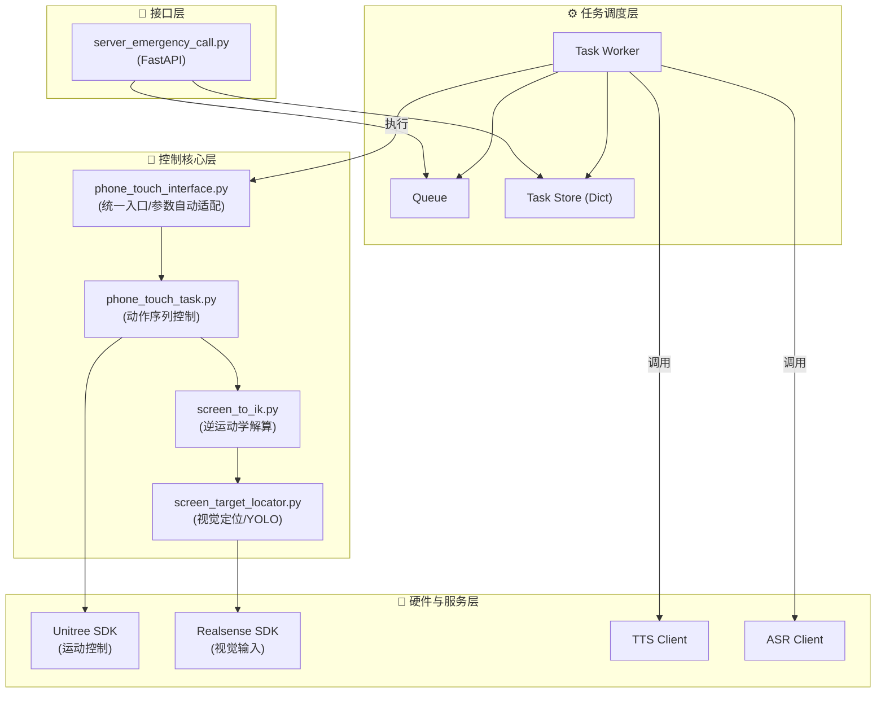
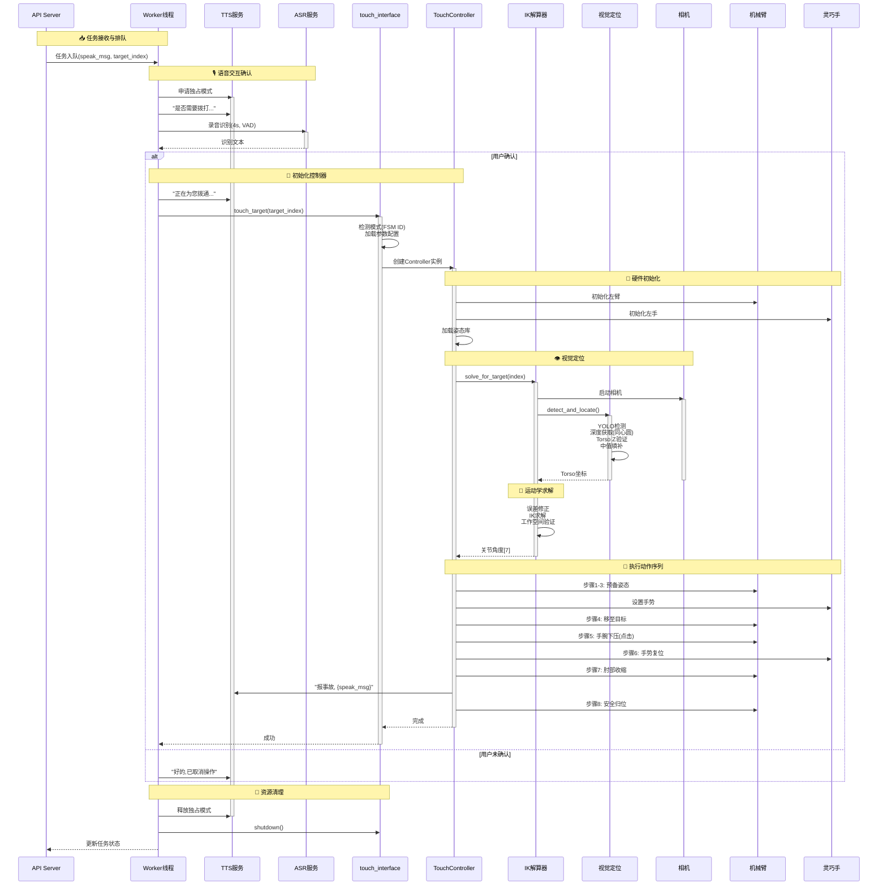

# Emergency Call 紧急呼叫系统

## 系统概述

Emergency Call 是一个集成了机械臂控制、视觉定位、语音交互（TTS/ASR）的自动化触屏系统。主要用于在变电站等场景下，通过语音指令触发机器人点击屏幕上的特定区域（如拨打紧急电话），并播报告警信息。

该系统通过 RESTful API 对外提供服务，支持任务排队、状态查询和异常处理。

## 系统架构

系统采用**生产者-消费者**模型，Web Server 负责接收请求并入队，后台 Worker 线程负责串行执行复杂的机械臂与语音交互任务。

### 1. 软件组件架构

系统分为接口层、任务调度层、控制层和硬件抽象层。



### 2. 触碰屏幕流程



## 核心模块详解

以下是系统中 5 个核心代码文件的功能说明：

### 1. `server_emergency_call.py` (服务入口)
- **功能**: 提供 RESTful API 接口，负责任务的接收、排队和调度。
- **核心逻辑**:
  - 维护 `task_queue` 实现生产者-消费者模型，确保任务串行执行。
  - 集成 `TTSClient` 和 `ASRClient`，实现“询问-确认”的语音交互闭环。
  - 申请 **TTS独占模式**，防止其他语音干扰紧急呼叫流程。
  - 捕获所有下层模块抛出的异常，统一进行日志记录和语音播报。

### 2. `phone_touch_interface.py` (控制接口)
- **功能**: 作为上层服务与底层控制器的中间层，提供统一的调用入口。
- **核心逻辑**:
  - **单例模式**: 维护全局唯一的 `PhoneTouchController` 实例。
  - **参数自动适配**: 自动检测机器人当前的运动模式（走跑 ID:801 / 常规），动态加载对应的参数配置：
    - **走跑模式**: `expected_torso_z` = -0.17m, 更大的 `wrist_pitch`。
    - **常规模式**: `expected_torso_z` = -0.15m。
  - **异常边界**: 捕获并封装底层异常，向上层提供清晰的错误信息。

### 3. `screen_target_locator.py` (视觉定位)
- **功能**: 负责屏幕目标的识别与三维坐标获取。
- **核心逻辑**:
  - **YOLO 检测**: 调用远程 YOLO 服务识别屏幕上的 Grid 区域。
  - **深度获取策略 (DepthHelper)**:
    1. **直接获取**: 读取中心点深度。
    2. **同心圆搜索**: 如果中心点无效，向外扩散搜索有效深度。
    3. **中值填补**: 如果上述均失败，收集周围所有有效点取中值（抗反光干扰）。
  - **Torso Z 验证**: 将相机坐标转换为 Torso 坐标，校验 Z 值是否在预期范围内（如 -0.17m ± 5cm），有效防止深度漂移导致的误操作。

### 4. `screen_to_ik.py` (IK 解算)
- **功能**: 将屏幕目标坐标转换为机械臂的关节角度。
- **核心逻辑**:
  - **集成器**: 内部实例化 `ScreenTargetLocator`，串联视觉定位与运动学计算。
  - **IK 求解**: 使用 `ikpy` 库，根据目标坐标和当前手掌姿态约束，反解出 7 个关节角度。
  - **误差修正**: 应用测量误差补偿向量（`measurement_error`）。
  - **安全校验**: 检查解算结果的位置误差（<5cm）和是否超出机械臂工作空间（Torso X/Y Range）。

### 5. `phone_touch_task.py` (动作控制)
- **功能**: 负责执行具体的机械臂动作序列。
- **核心逻辑**:
  - **完整生命周期**: 预备 -> 接近 -> 点击 -> 收缩 -> 归位。
  - **精细点击**: 到达目标位置后，通过**手腕下压 (Wrist Pitch)** 实现点击，而非整体手臂下压，提高精度和安全性。
  - **安全收缩**: 点击完成后，优先执行灵巧手复位和肘部后撤，避免回退时刮擦屏幕。
  - **智能退出**: 实现了 `_safe_emergency_exit` 机制，在发生异常或用户中断时，强制机械臂安全归位。

## 目录结构

```text
phone/
├── server_emergency_call.py    # 🚀 服务入口 (FastAPI)
├── phone_touch_interface.py    # 🔌 控制器封装接口 (自动适配参数)
├── phone_touch_task.py         # 🧠 机械臂任务控制器 (动作序列)
├── screen_to_ik.py             # 🧮 屏幕坐标到IK解算
├── screen_target_locator.py    # 👁️ 视觉定位 (YOLO + Realsense)
├── touch_exceptions.py         # ⚠️ 自定义异常类
├── start_emergency_call.sh     # 📜 启动脚本
├── stop_emergency_call.sh      # 📜 停止脚本
└── docs/                       # 📚 文档目录
    ├── emergency_call.md       #    - 系统架构文档
    └── interface/              #    - 接口文档
        └── server_emergency_call.md
```