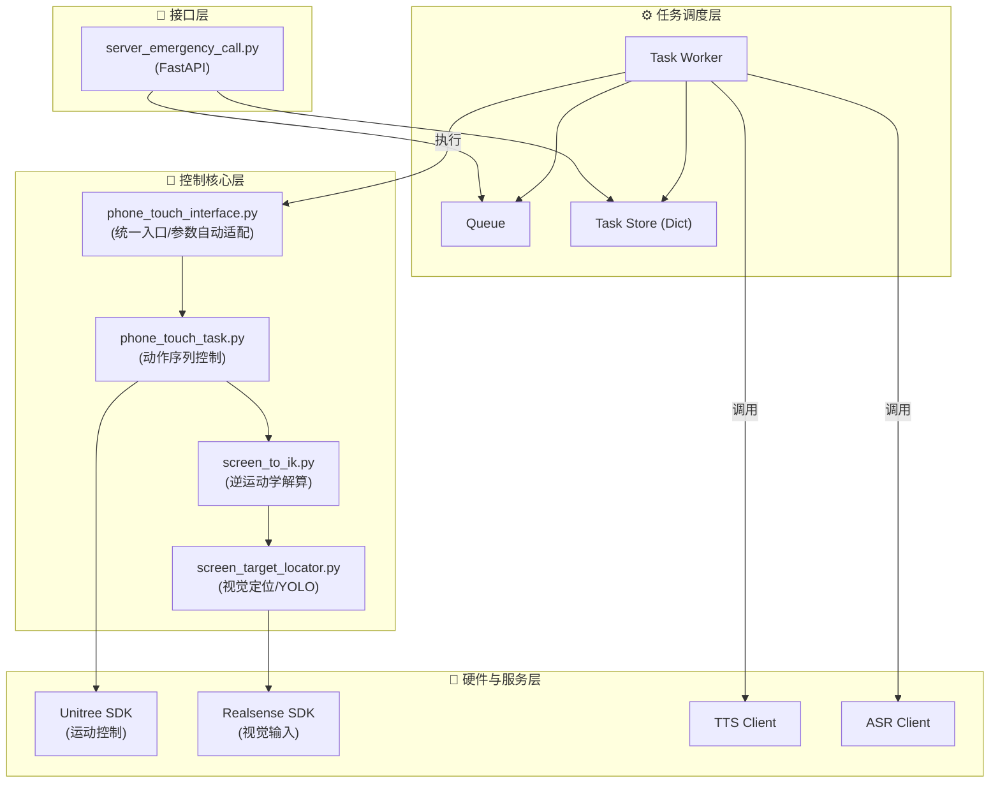

```mermaid
graph TB
    subgraph Layer1 ["🔌 接口层"]
        API["server_emergency_call.py<br/>(FastAPI)"]
    end

    subgraph Layer2 ["⚙️ 任务调度层"]
        Worker["Task Worker"]
        Queue["Queue"]
        Store["Task Store (Dict)"]
    end

    subgraph Layer3 ["🧠 控制核心层"]
        Interface["phone_touch_interface.py<br/>(统一入口/参数自动适配)"]
        TaskCtrl["phone_touch_task.py<br/>(动作序列控制)"]
        Locator["screen_target_locator.py<br/>(视觉定位/YOLO)"]
        IKSolver["screen_to_ik.py<br/>(逆运动学解算)"
]
    end

    subgraph Layer4 ["📡 硬件与服务层"]
        LocoClient["Unitree SDK<br/>(运动控制)"]
        Camera["Realsense SDK<br/>(视觉输入)"]
        TTS["TTS Client"]
        ASR["ASR Client"]
    end

    %% 关系
    API --> Queue
    API --> Store
    Worker --> Queue
    Worker --> Store
    
    Worker -->|调用| TTS
    Worker -->|调用| ASR
    Worker -->|执行| Interface
    
    Interface --> TaskCtrl
    TaskCtrl --> IKSolver
    TaskCtrl --> LocoClient
    IKSolver --> Locator
    Locator --> Camera
```