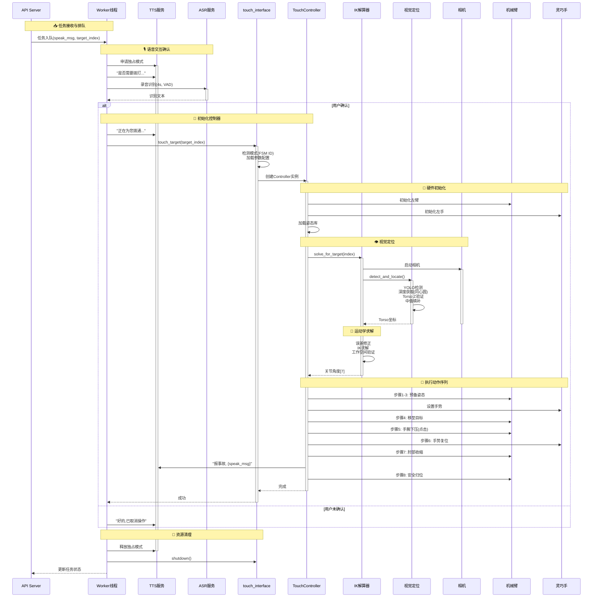

```mermaid
sequenceDiagram
    participant API as API Server
    participant Worker as Worker线程
    participant TTS as TTS服务
    participant ASR as ASR服务
    participant Interface as touch_interface
    participant Task as TouchController
    participant IK as IK解算器
    participant Vision as 视觉定位
    participant Camera as 相机
    participant Arm as 机械臂
    participant Hand as 灵巧手

    Note over API,Worker: 📥 任务接收与排队
    API->>Worker: 任务入队(speak_msg, target_index)
    
    Note over Worker,ASR: 🎙️ 语音交互确认
    Worker->>TTS: 申请独占模式
    activate TTS
    Worker->>TTS: "是否需要拨打..."
    Worker->>ASR: 录音识别(4s, VAD)
    activate ASR
    ASR-->>Worker: 识别文本
    deactivate ASR
    
    alt 用户确认
        Note over Worker,Task: 🤖 初始化控制器
        Worker->>TTS: "正在为您拨通..."
        Worker->>Interface: touch_target(target_index)
        activate Interface
        Interface->>Interface: 检测模式(FSM ID)<br/>加载参数配置
        Interface->>Task: 创建Controller实例
        activate Task
        
        Note over Task,Hand: 🔧 硬件初始化
        Task->>Arm: 初始化左臂
        Task->>Hand: 初始化左手
        Task->>Task: 加载姿态库
        
        Note over Task,Camera: 👁️ 视觉定位
        Task->>IK: solve_for_target(index)
        activate IK
        IK->>Camera: 启动相机
        activate Camera
        IK->>Vision: detect_and_locate()
        activate Vision
        Vision->>Vision: YOLO检测<br/>深度获取(同心圆)<br/>Torso Z验证<br/>中值填补
        Vision-->>IK: Torso坐标
        deactivate Vision
        deactivate Camera
        
        Note over IK: 🧮 运动学求解
        IK->>IK: 误差修正<br/>IK求解<br/>工作空间验证
        IK-->>Task: 关节角度[7]
        deactivate IK
        
        Note over Task,Hand: 🦾 执行动作序列
        Task->>Arm: 步骤1-3: 预备姿态
        Task->>Hand: 设置手势
        Task->>Arm: 步骤4: 移至目标
        Task->>Arm: 步骤5: 手腕下压(点击)
        Task->>Hand: 步骤6: 手势复位
        Task->>Arm: 步骤7: 肘部收缩
        Task->>TTS: "报事故, {speak_msg}"
        Task->>Arm: 步骤8: 安全归位
        
        Task-->>Interface: 完成
        deactivate Task
        Interface-->>Worker: 成功
        deactivate Interface
        
    else 用户未确认
        Worker->>TTS: "好的,已取消操作"
    end
    
    Note over Worker,Interface: 🧹 资源清理
    Worker->>TTS: 释放独占模式
    deactivate TTS
    Worker->>Interface: shutdown()
    Worker-->>API: 更新任务状态
```
